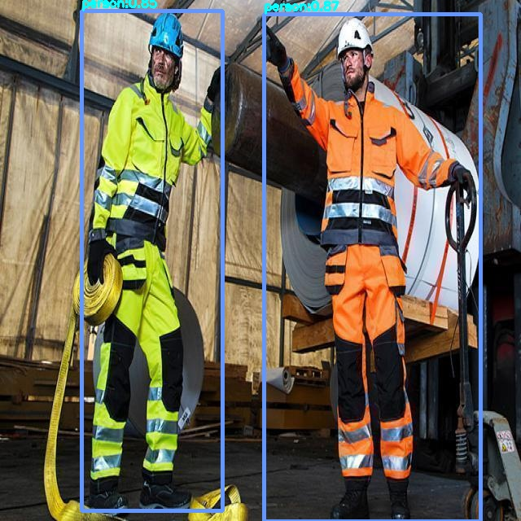
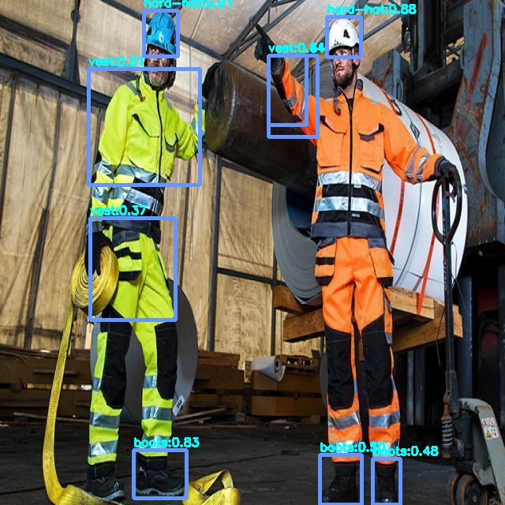
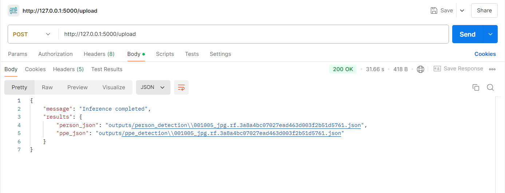
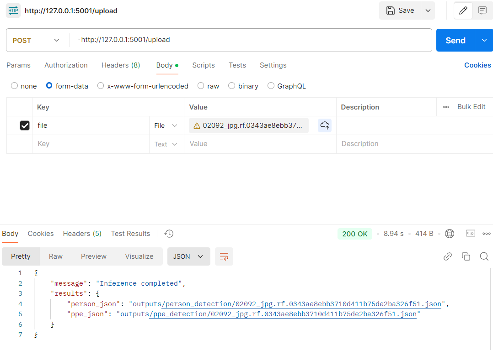

# Person and PPE (Personal Protective Equipment) Detection Using YOLOv8

This project leverages the YOLOv8 object detection model to detect persons and their associated PPE in images. The system is designed to assist in ensuring safety compliance in industrial and construction environments by identifying the presence or absence of critical safety gear.

## Project Overview

### Key Features:
- **Custom Object Detection Models:** Trained YOLOv8 models for detecting persons and various PPE items such as helmets, vests, and gloves.
- **Flask-based API:** Provides a web service for easy image upload and inference.
- **Docker Containerization:** Ensures portability and consistent runtime environments for the application.
- **JSON Output:** Detection results are saved in JSON format for further analysis.

---

## 1. Model Training

### Dataset Preparation:
1. **Dataset:** 
   - Custom dataset consisting of 416 images labeled in PascalVOC format.
2. **Conversion to YOLO Format:**
   - The labels were converted into YOLO format using `PASCALVOC_to_yolo.py`.
   - For person detection, only the `person` class was included.
   - For PPE detection, the following classes were retained:
     - Helmet
     - Vest
     - Gloves
   - Imbalanced classes such as `glasses`, `ear-protector`, and `safety-harness` were omitted to improve training.

3. **Data Split:**
   - Training: 70%
   - Validation: 20%
   - Testing: 10%

### Model Training:
- **Person Detection Model:**
  - Trained on YOLOv8 using 70 epochs.
  - Best weights saved as `person_det_best.pt`.
  
- **PPE Detection Model:**
  - Trained separately for 80 epochs.
  - Best weights saved as `PPE_det_best.pt`.

### Model Evaluation:
- **Person Detection Model:**
  - mAP@0.5: 85.7%
  - mAP@0.5:0.95: 58.7%
  - F1 Score: 0.802
  
- **PPE Detection Model:**
  - mAP@0.5: 49.4%
  - mAP@0.5:0.95: 31.6%
  - F1 Score: 0.50

---

## 2. Inference (AI Backend)

The trained models are used for inference on new images using `person_ppe_inference.py` in person_ppe_inference folder. Detection results for persons and PPE are saved as JSON files in structured directories (`person_detection` and `ppe_detection`).

### Person Detection 



### PPE Detection



---

## 3. Flask API Backend

A Flask application serves as the UI backend for image uploads and inference. Input images are stored in uploads folder and inferred output detected images with repective JSON files are 
saved in outputs folder.

### Key Endpoints:
- **`/upload` (POST):** Accepts an image file and returns JSON results with detection outputs.
  - **Usage with `curl`:**
    ```bash
    curl -X POST -F "file=@<path_to_image>" http://127.0.0.1:5000/upload
    ```
  - **Sample JSON Output:**

  

   **Sample JSON files Output for Person Detection:**
  ``` json

  [
    {
        "filename": "outputs/person_detection/ppe_0153_jpg.rf.0a7eb92dfb9f20c77848ea88eda2cf3c.jpg",
        "bbox": [
            324.93682861328125,
            17.22503662109375,
            590.7915649414062,
            640.0
        ],
        "class": "person",
        "Confidence": 0.8747962117195129
    },
    {
        "filename": "outputs/person_detection/ppe_0153_jpg.rf.0a7eb92dfb9f20c77848ea88eda2cf3c.jpg",
        "bbox": [
            100.27755737304688,
            13.9188232421875,
            273.1982421875,
            627.4461669921875
        ],
        "class": "person",
        "Confidence": 0.8515754342079163
    }
  ]
  ```
  
**Sample JSON files Output for PPE Detection:**

  ```json
   [
    {
        "filename": "outputs/ppe_detection/ppe_0153_jpg.rf.0a7eb92dfb9f20c77848ea88eda2cf3c.jpg",
        "bbox": [
            182.4151153564453,
            13.298957824707031,
            225.1749725341797,
            71.82559204101562
        ],
        "class": "hard-hat",
        "Confidence": 0.9138474464416504
    },
    {
        "filename": "outputs/ppe_detection/ppe_0153_jpg.rf.0a7eb92dfb9f20c77848ea88eda2cf3c.jpg",
        "bbox": [
            414.342041015625,
            21.2069149017334,
            457.29052734375,
            72.11396026611328
        ],
        "class": "hard-hat",
        "Confidence": 0.8823174238204956
    },
    {
        "filename": "outputs/ppe_detection/ppe_0153_jpg.rf.0a7eb92dfb9f20c77848ea88eda2cf3c.jpg",
        "bbox": [
            169.83941650390625,
            570.4639892578125,
            236.969482421875,
            631.4427490234375
        ],
        "class": "boots",
        "Confidence": 0.8346132636070251
    },
    {
        "filename": "outputs/ppe_detection/ppe_0153_jpg.rf.0a7eb92dfb9f20c77848ea88eda2cf3c.jpg",
        "bbox": [
            112.69296264648438,
            87.88720703125,
            253.63723754882812,
            234.73019409179688
        ],
        "class": "vest",
        "Confidence": 0.8050929307937622
    },
    {
        "filename": "outputs/ppe_detection/ppe_0153_jpg.rf.0a7eb92dfb9f20c77848ea88eda2cf3c.jpg",
        "bbox": [
            340.7537841796875,
            70.245361328125,
            388.0257568359375,
            158.12017822265625
        ],
        "class": "vest",
        "Confidence": 0.6410557627677917
    },
    {
        "filename": "outputs/ppe_detection/ppe_0153_jpg.rf.0a7eb92dfb9f20c77848ea88eda2cf3c.jpg",
        "bbox": [
            405.44866943359375,
            576.243896484375,
            458.4827880859375,
            639.551513671875
        ],
        "class": "boots",
        "Confidence": 0.5035118460655212
    },
    {
        "filename": "outputs/ppe_detection/ppe_0153_jpg.rf.0a7eb92dfb9f20c77848ea88eda2cf3c.jpg",
        "bbox": [
            472.35369873046875,
            581.5798950195312,
            507.70123291015625,
            639.6526489257812
        ],
        "class": "boots",
        "Confidence": 0.4752107262611389
    },
    {
        "filename": "outputs/ppe_detection/ppe_0153_jpg.rf.0a7eb92dfb9f20c77848ea88eda2cf3c.jpg",
        "bbox": [
            340.38153076171875,
            70.52970886230469,
            402.8143310546875,
            173.86917114257812
        ],
        "class": "vest",
        "Confidence": 0.4144391417503357
    },
    {
        "filename": "outputs/ppe_detection/ppe_0153_jpg.rf.0a7eb92dfb9f20c77848ea88eda2cf3c.jpg",
        "bbox": [
            114.29150390625,
            276.96429443359375,
            222.38836669921875,
            405.86553955078125
        ],
        "class": "vest",
        "Confidence": 0.367709755897522
    }
]

  ```
- **`/download/<path>` (GET):** Allows downloading of specific result files.

### Running the Flask App Locally:
```bash
python app.py
```
### Docker implementation:

Download Docker Desktop and install it. 

**Build Docker image of project folder:**

```bash
docker build -t person_ppe_inference . 
```

**Run Docker image:**

```bash
docker run -p 5001:5000 -v E:/AIMonk_Labs_Assessment/person_detection/datasets/weights:/app/person_weights -v E:/AIMonk_Labs_Assessment/ppe_detection/datasets/weights:/app/ppe_weights -v E:/AIMonk_Labs_Assessment/person_ppe_inference/outputs:/app/outputs person_ppe_inference 
```
**Test it using Postman:**


